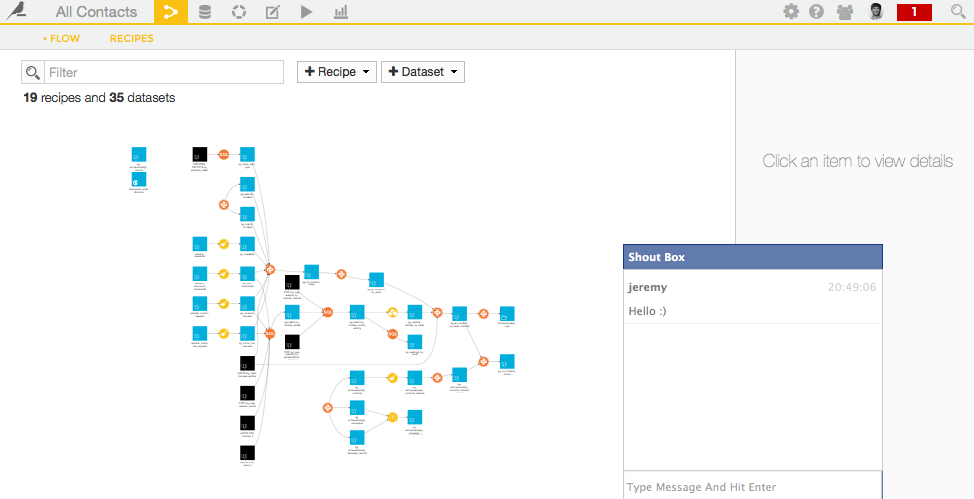

Shoutbox for Data Science Studio
--------------------------------

V0.4

## How to install

    cd /path/to/dataiku-dss-2.x.x
    wget https://raw.githubusercontent.com/jereze/dataiku-dss-shoutbox/master/shoutbox-installer.py
    python shoutbox-installer.py

## How to modify

Install dependencies:

    npm install html-minifier -g
    npm install uglify-js -g

Minify before pushing:

    make

## Changelob

**Version 0.4 (2015-09-03)**

* Visual notification for a new message
* Remember when shoutbox is opene/closed + same behaviour in every tab (settings saved in local storage)

**Version 0.3 (2015-08-17)**

* Audio notification for a new message

**Version 0.2 (2015-08-14)**

* Better style
* Avatars
* Fix up/down icon

**Version 0.1 (2015-08-13)**

* Proof of concept

## Credit

Audio notification file from [Ion.Sound](/IonDen/ion.sound).